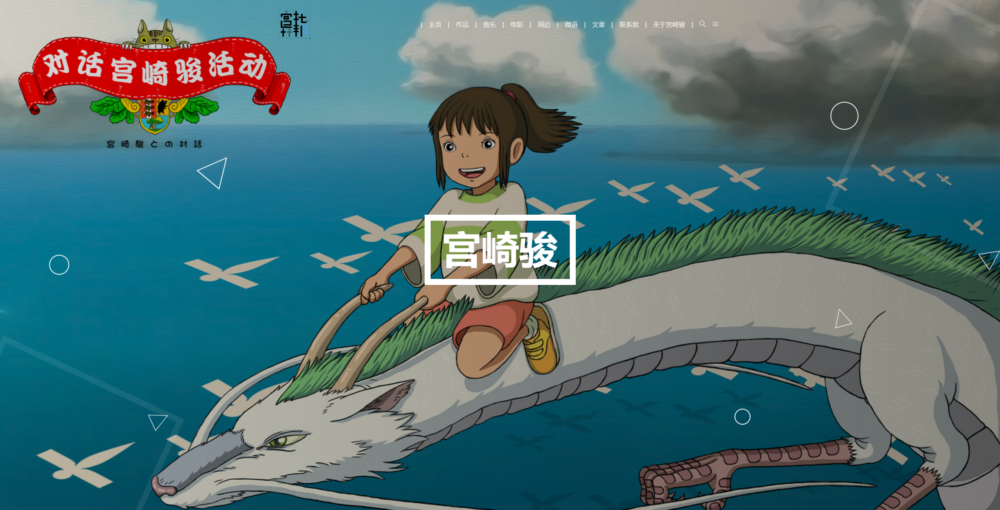
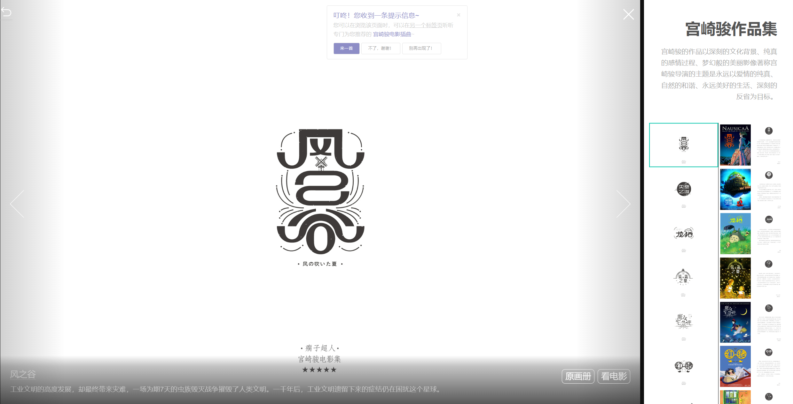
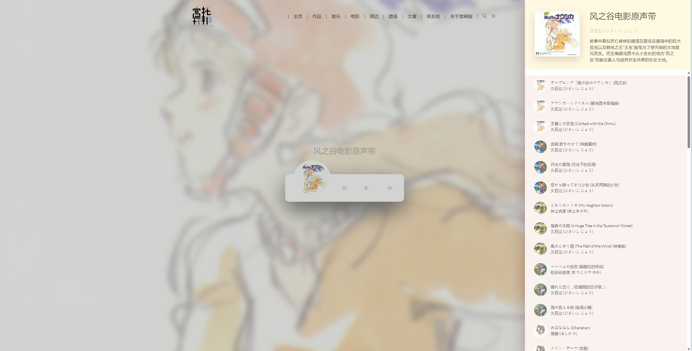
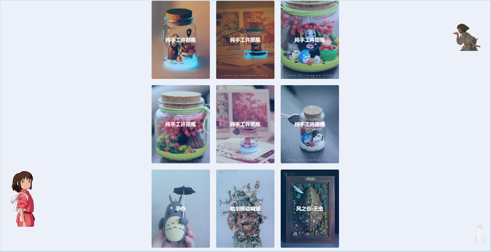
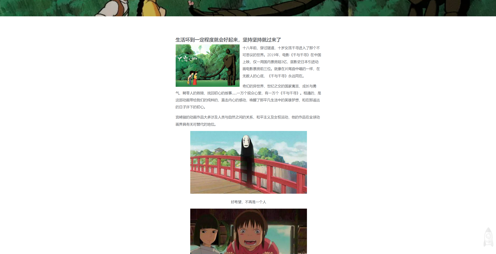
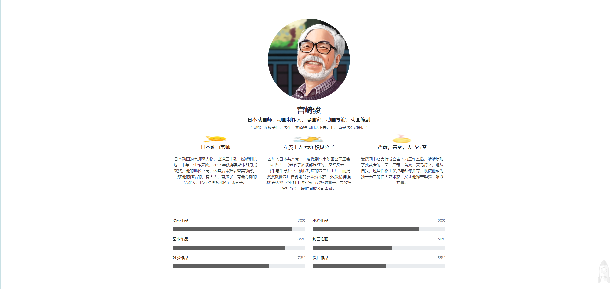

# Hayao_Miyazaki

<p>
    <a href="https://github.com/Chenmo1212/Hayao_Miyazaki" target="_blank">
        
    </a>
    <a href="https://github.com/Chenmo1212/Hayao_Miyazaki/issues" target="_blank">
        
    </a>
    <a href="https://github.com/Chenmo1212/Hayao_Miyazaki/pulls" target="_blank">
        
    </a>
    <a href="/"></a>
    <a href="https://github.com/Chenmo1212/Hayao_Miyazaki" target="_blank">
        
    </a>
<br/>
<br/>
    <a href="https://github.com/Chenmo1212/Hayao_Miyazaki" target="_blank">
        
    </a>
    <a href="https://github.com/Chenmo1212/Hayao_Miyazaki" target="_blank">
        
    </a>
    <a href="https://github.com/Chenmo1212/Hayao_Miyazaki" target="_blank">
        
    </a>
    <a href="https://github.com/Chenmo1212/Hayao_Miyazaki" target="_blank">
        
    </a>
</p>



## Description

使用原生HTMl，CSS，JS开发的宫崎骏主题网站。初衷是因为大学同学很喜欢宫崎骏，恰逢当时一门课的课设作业就是需要开发一个Web网站。这也是这个网站的由来，是作为一个礼物赠送给同学。

里面涵盖了宫崎骏的基本介绍，**所有的电影原画集**，**所有的电影原声带插曲**，以及**所有的电影资源**。此外还插入了一些周边，电影语录，以及关于宫崎骏电影评价的一些文章。

- [01 热门电影合集](https://toastpublic-my.sharepoint.com/:f:/g/personal/chenmo_toastpublic_onmicrosoft_com/Emq40fYLB45Kt9tTJS4AqjcBj5tURpNOJ_iLQN2tITTddA?e=yVXPRV)
- [02 原画集](https://toastpublic-my.sharepoint.com/:f:/g/personal/chenmo_toastpublic_onmicrosoft_com/EutcxbYivuxIvGajG5a9G_oBwuj3O1WGeECrgSBUCTq9cQ?e=3dLeVF)
- [03 电影原声带插曲](https://toastpublic-my.sharepoint.com/:f:/g/personal/chenmo_toastpublic_onmicrosoft_com/EoFwWhJAtkJFmBLGnH6UK3oBHf5fdzmB1FNrzKTOAsys6g?e=wPOcrx)

## Installation

1. Clone the repository:

   ```cmd
   git clone https://github.com/Chenmo1212/Hayao_Miyazaki.git
   ```

2. Navigate to the project directory:

   ```cmd
   cd Hayao_Miyazaki
   ```

3. Then run `index.html` as a local server.

## Screenshots








## Contributing
Contributions are welcome! Please feel free to submit a pull request or open an issue if you find a bug or have a suggestion for a new feature.

## License
This project is licensed under the MIT License.
